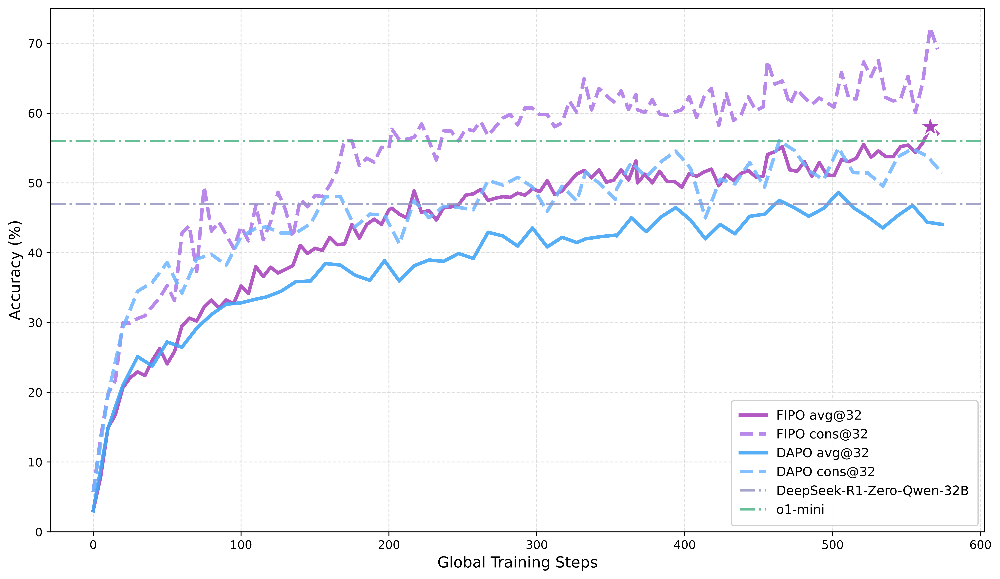
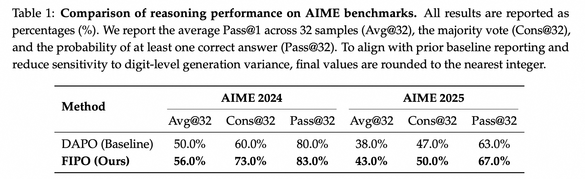

# FIPO: Eliciting Deep Reasoning with Future-KL Influenced Policy Optimization

🏠 [Homepage](https://qwen-pilot.notion.site/fipo) | 📝 [Paper PDF](./assets/FIPO_Eliciting_Deep_Reasoning_with_Future_KL_Influenced_Policy_Optimization.pdf) | 🤗 [Hugging Face](https://huggingface.co/Henrymachiyu/FIPO) | ModelScope [ModelScope](https://modelscope.cn/models/Henrymachiyu/FIPO) | 🐱 [GitHub](https://github.com/Henrymachiyu/FIPO)

FIPO is a Future-KL-influenced RL recipe for eliciting longer and deeper reasoning in ORM/GRPO-style training.

## Introduction



*Figure 1. FIPO vs. Baselines Performance Comparison on AIME2024. FIPO demonstrates that pure RL training alone is sufficient to not only outperform other pure RL baselines (the reproduced DAPO and Deepseek-R1-Zero-32B), but also surpass o1-mini. This performance gain is accompanied by the generation of significantly longer responses on average.*

Reinforcement learning with verifiable rewards often applies a single trajectory-level signal to every token in the response. In practice, this creates a coarse credit-assignment bottleneck: critical reasoning pivots and trivial continuation tokens receive the same optimization pressure.

FIPO addresses this limitation by reweighting token-level policy updates with a discounted future-KL signal. The result is a denser training signal that emphasizes tokens with stronger downstream influence on the future trajectory.

In our 32B setting, this change pushes AIME 2024 Pass@1 from the DAPO-level **50.0%** to a peak of **58.0%**, converging around **56.0%**, while the average response length grows from roughly **4k** to **10k** tokens.

## Core Change

FIPO keeps the standard PPO/DAPO training pipeline, but replaces the plain token-level policy gradient weighting with a future-aware influence weight:

```text
future_kl_t = sum_{j >= t} gamma^(j - t) * delta_logp_j
influence_t = clip(exp(future_kl_t), lower, upper)
loss_t = PPO_clip(ratio_t, advantage_t * influence_t)
```

At a high level, the implementation does the following:

1. Compute the usual token-level ratio and clipped PPO objective.
2. Accumulate discounted future KL for each response token.
3. Convert that future KL into an influence weight.
4. Clamp the weight range and apply a safety guard for extreme negative-advantage ratios.
5. Reweight the token advantages before the final policy loss.

The main implementation hooks are already in this repo:

- `verl/trainer/ppo/core_algos.py`
- `verl/workers/config/actor.py`
- `verl/workers/actor/dp_actor.py`
- `verl/workers/actor/megatron_actor.py`

The practical interface is a small set of `policy_loss` switches:

```yaml
actor_rollout_ref:
  actor:
    ppo_mini_batch_size: 64
    policy_loss:
      loss_mode: future_kl
      decay_rate: 32.0
      chunk_size: 128
      future_kl_start: include_current
      future_kl_window: -1
      future_kl_average: false
      future_kl_clip_ratio: 0.2
      future_kl_clip_high_only: true
      safety_thresh: 10.0
```

## Getting Started

FIPO is built on top of the existing VeRL and DAPO training stack in this repository.

- Follow the standard VeRL environment setup and cluster preparation flow.
- Reuse the same Ray runtime pattern as the DAPO recipe.
- Use the new FIPO launcher in `recipe/fipo/` as the default 32B entrypoint.

Useful local references:

- DAPO recipe overview: [`recipe/dapo/README.md`](./recipe/dapo/README.md)
- DAPO baseline launcher: [`recipe/dapo/run_dapo_qwen2.5_32b.sh`](./recipe/dapo/run_dapo_qwen2.5_32b.sh)
- FIPO launcher: [`recipe/fipo/run_fipo_qwen2.5_32b.sh`](./recipe/fipo/run_fipo_qwen2.5_32b.sh)

## Training

The recommended launcher is:

```bash
bash recipe/fipo/run_fipo_qwen2.5_32b.sh
```

A typical submission flow looks like this:

```bash
cd fipo
bash recipe/fipo/run_fipo_qwen2.5_32b.sh
```

The script keeps the DAPO-style defaults and leaves the major paths env-overridable, including `MODEL_PATH`, `TRAIN_FILE`, `TEST_FILE`, `CKPTS_DIR`, and `NNODES`.

## What changed in the scripts?

Compared with the DAPO 32B launcher, the FIPO launcher keeps the same training entrypoint and most rollout settings, but changes the optimization behavior in a few targeted places:


- `actor_rollout_ref.actor.ppo_mini_batch_size` is increased from `32` to `64`.
- `actor_rollout_ref.actor.policy_loss.loss_mode` switches from the default PPO-style objective to `future_kl`.
- FIPO-specific knobs are added through `policy_loss`, especially `decay_rate`, `chunk_size`, `future_kl_clip_ratio`, `future_kl_clip_high_only`, `future_kl_start`, `future_kl_window`, `future_kl_average`, and `safety_thresh`.

The core FIPO part of the launcher is intentionally compact:

```bash
actor_rollout_ref.actor.ppo_mini_batch_size=64 \
actor_rollout_ref.actor.policy_loss.loss_mode=future_kl \
+actor_rollout_ref.actor.policy_loss.decay_rate=32.0 \
+actor_rollout_ref.actor.policy_loss.chunk_size=128 \
+actor_rollout_ref.actor.policy_loss.future_kl_clip_ratio=0.2 \
+actor_rollout_ref.actor.policy_loss.future_kl_clip_high_only=True \
+actor_rollout_ref.actor.policy_loss.future_kl_start=include_current \
+actor_rollout_ref.actor.policy_loss.future_kl_window=-1 \
+actor_rollout_ref.actor.policy_loss.future_kl_average=False \
+actor_rollout_ref.actor.policy_loss.safety_thresh=10.0
```

## 📊 Results & Figures

### Main Result

FIPO is designed to lengthen and deepen reasoning under the same DAPO-style training scaffold rather than replacing the whole pipeline. In the paper's 32B setting, the main takeaway is straightforward: the FIPO objective yields longer responses and a stronger AIME 2024 peak than the DAPO baseline.

- DAPO baseline: **50.0%** AIME 2024 Pass@1
- FIPO: **58.0%** peak AIME 2024 Pass@1, converging around **56.0%**
- Response length: roughly **4k** to **10k** tokens during training




### Training Dynamics

The paper also tracks response-length growth, entropy, reward, and related training signals to show that FIPO is not only improving a final benchmark number but also changing the trajectory of reasoning behavior during training.


*Dynamics of response length and performance scaling during training. Subplots (a)-(e) show the evolution of response length metrics (Min, Q25, Mean, Median, Q75) over global training steps. Compared to the DAPO baseline, FIPO significantly increases response length, effectively eliciting more extensive Chain-of-Thought reasoning. Subplot (f) demonstrates that this increased length correlates strongly with improved accuracy, suggesting that longer CoT is key to breaking performance barriers.*

## 🎈 Citation

BibTeX will be added once the final citation metadata is ready.

## 🌻 Acknowledgement

This project builds on top of the **VeRL** training framework and follows the practical recipe structure introduced by **DAPO**.

- VeRL repository: <https://github.com/volcengine/verl>
- DAPO recipe in this repo: [`recipe/dapo`](./recipe/dapo)
